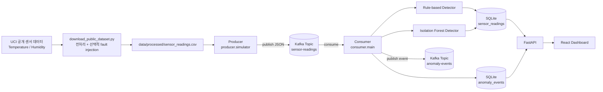
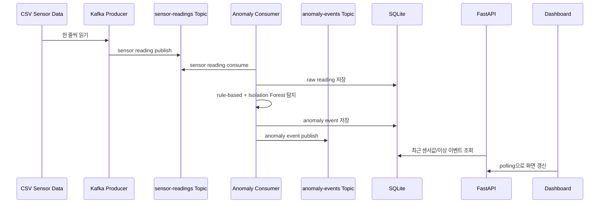
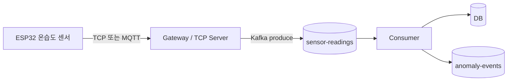
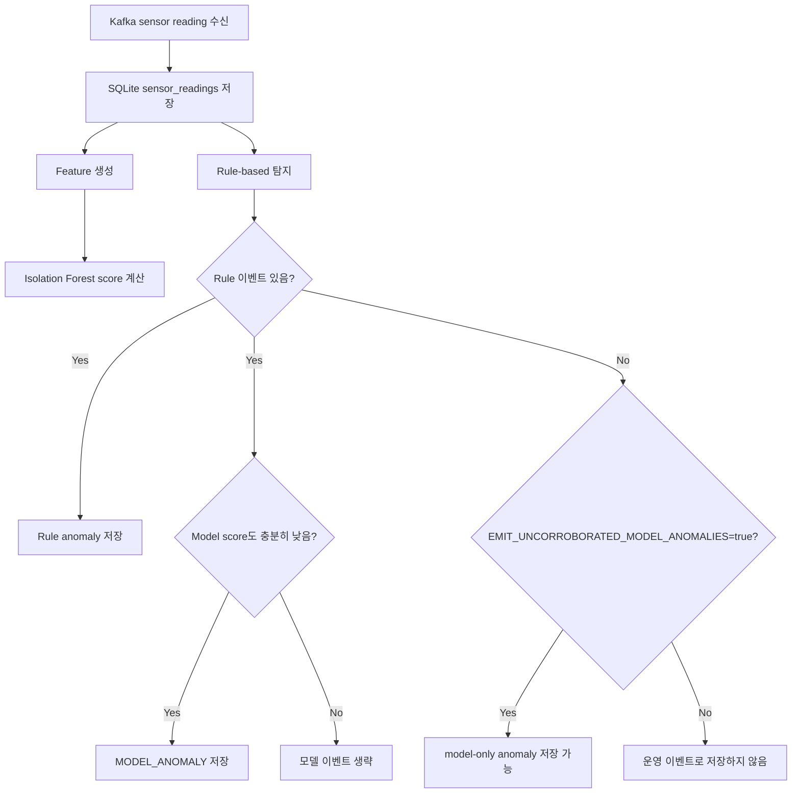

# Kafka Sensor Anomaly Pipeline

치톤피드 온습도 센서 흐름을 확장한 **Kafka 기반 실시간 센서 이상탐지 파이프라인**입니다.

목표는 고성능 ML 모델 개발이 아니라, 다음 흐름을 직접 구현해보는 것입니다.

```text
센서 데이터 수집 -> Kafka 스트리밍 -> 이상탐지 -> DB 저장 -> API -> Dashboard
```

## 실행

Windows PowerShell 기준 한 번에 실행:

```powershell
cd experiments/sensor-anomaly-pipeline
.\start.ps1
```

한 번에 종료:

```powershell
.\stop.ps1
```

실행 후 URL:

- Dashboard: http://localhost:5173
- FastAPI: http://localhost:8000/docs
- Kafka UI: http://localhost:8080

옵션:

```powershell
.\start.ps1 -Limit 240 -Interval 0.001
.\start.ps1 -NoFaultInjection
.\start.ps1 -KeepDatabase
```

옵션 의미:

- `-Limit`: Kafka로 publish할 CSV row 수
- `-Interval`: 메시지 publish 간격. `1.0`이면 1초마다 1건
- `-NoFaultInjection`: 공개 데이터 원본만 사용하고 데모용 이상치 주입 안 함
- `-KeepDatabase`: 기존 SQLite DB를 지우지 않고 유지

## 전체 구조



## Kafka 개념 정리

이 프로젝트에서 Kafka는 **센서 데이터가 지나가는 메시지 버스** 역할을 합니다.



용어:

- **Producer**: Kafka topic에 메시지를 보내는 코드
- **Consumer**: Kafka topic에서 메시지를 읽는 코드
- **Topic**: 메시지가 쌓이는 이름 있는 통로
- **Consumer group**: 여러 consumer가 같은 topic을 나눠 읽을 때 쓰는 그룹 id
- **Broker**: Kafka 서버

Producer/consumer와 pub/sub의 차이:

```text
Pub/Sub
- 메시지를 발행하고 구독하는 통신 패턴

Producer/Consumer
- 메시지를 생산하고 소비하는 역할 이름
```

Kafka도 넓게 보면 pub/sub처럼 쓸 수 있지만, 핵심은 topic에 메시지를 저장하고 consumer가 offset 기준으로 poll해서 읽는 구조입니다.

```text
Producer는 Kafka에 push
Consumer는 Kafka에서 poll
```

이 프로젝트의 topic:

| Topic | 역할 |
| --- | --- |
| `sensor-readings` | producer가 보낸 원천 센서값 |
| `anomaly-events` | consumer가 만든 이상탐지 이벤트 |

IoT 현장에서는 MQTT와 Kafka를 같이 쓰는 구조가 더 자연스럽습니다.



이 프로젝트에서는 gateway 대신 CSV replay producer를 사용했습니다. 실제 치톤피드에 붙이면 기존 TCP 서버가 센서 데이터를 받은 직후 `sensor-readings` topic에 produce하면 됩니다.

## 데이터셋

기본 입력은 **UCI Occupancy Detection** 공개 데이터셋입니다.

- Source: https://archive.ics.uci.edu/dataset/357/occupancy+detection
- Download URL: https://archive.ics.uci.edu/static/public/357/occupancy+detection.zip
- 사용 컬럼: `date`, `Temperature`, `Humidity`
- 변환 결과: `data/processed/sensor_readings.csv`

원본 데이터는 사무실 환경에서 수집된 온도, 습도, 조도, CO2 기반 occupancy detection 데이터입니다. 여기서는 온습도 센서 파이프라인 실험에 맞게 다음처럼 변환합니다.

```text
date -> measured_at
Temperature -> temperature
Humidity -> humidity
device_id -> office-occupancy-sensor-001
battery -> 100.0
```

전처리 실행:

```powershell
python scripts/download_public_dataset.py
```

데모용 이상치까지 주입:

```powershell
python scripts/download_public_dataset.py --inject-demo-faults
```

데모용 fault injection은 공개 데이터 흐름에 아래 상황을 일부 추가합니다.

- 온도 44도 구간
- 습도 12% 구간
- 온습도 값이 고정되는 sensor stuck 구간

## 센서 데이터 주기

원본 데이터의 `measured_at`은 대략 1분 간격입니다.

Kafka로 흘리는 속도는 producer 옵션으로 조정합니다.

```powershell
python -m producer.simulator --interval 1.0
```

`--interval 1.0`이면 1초마다 CSV 1 row를 Kafka에 publish합니다.

테스트용으로 빠르게 밀어 넣을 때:

```powershell
python -m producer.simulator --limit 240 --interval 0.001
```

정리:

```text
measured_at: 실제 센서가 측정한 시간, 약 1분 간격
publish interval: Kafka에 재생하는 속도, 기본 1초마다 1건
```

## 이상탐지 방식

Consumer는 센서값 하나를 받을 때마다 두 종류의 탐지를 수행합니다.



### Rule-based

명확한 운영 기준 기반 탐지입니다.

| Type | 조건 |
| --- | --- |
| `TEMP_HIGH` | temperature > 40 |
| `TEMP_LOW` | temperature < 5 |
| `HUMIDITY_HIGH` | humidity > 90 |
| `HUMIDITY_LOW` | humidity < 20 |
| `SUDDEN_TEMP_CHANGE` | 이전 값 대비 온도 10도 이상 변화 |
| `SUDDEN_HUMIDITY_CHANGE` | 이전 값 대비 습도 20% 이상 변화 |
| `SENSOR_STUCK` | 최근 5개 온습도 값이 완전히 동일 |

### Isolation Forest

Isolation Forest는 normal/anomaly 라벨을 정답으로 학습하는 지도 학습 모델이 아닙니다. 정상으로 볼 수 있는 구간의 feature 분포를 학습하고, 새 데이터가 그 분포에서 얼마나 벗어나는지 score를 계산합니다.

학습:

```powershell
python scripts/train_isolation_forest.py
```

모델 파일:

```text
models/isolation_forest.joblib
```

사용 feature:

- temperature
- humidity
- battery
- hour
- temperature/humidity diff
- rolling mean
- rolling standard deviation

기본 설정에서는 model-only anomaly를 운영 이벤트로 바로 저장하지 않습니다.

```text
EMIT_UNCORROBORATED_MODEL_ANOMALIES=false
MODEL_ANOMALY_SCORE_THRESHOLD=-0.08
```

즉 기본 데모에서는 **rule-based 이상이 있는 지점에서 모델도 강하게 이상하다고 본 경우** `MODEL_ANOMALY`를 함께 저장합니다. 이렇게 한 이유는 공개 데이터의 미묘한 분포 변화가 너무 많이 anomaly로 보이는 false positive를 줄이기 위해서입니다.

모델 단독 이상까지 보고 싶으면 `.env`에 다음을 설정합니다.

```text
EMIT_UNCORROBORATED_MODEL_ANOMALIES=true
```

## 메시지 예시

`sensor-readings` topic 메시지:

```json
{
  "device_id": "office-occupancy-sensor-001",
  "temperature": 23.7,
  "humidity": 26.272,
  "battery": 100.0,
  "measured_at": "2015-02-02T14:19:00"
}
```

`anomaly-events` topic 메시지:

```json
{
  "device_id": "office-occupancy-sensor-001",
  "reading_id": 81,
  "anomaly_type": "TEMP_HIGH",
  "anomaly_score": null,
  "reason": "temperature 44.0C is above 40C",
  "measured_at": "2015-02-02T15:39:00",
  "detected_at": "2026-05-29T05:30:00"
}
```

## DB Schema

### `sensor_readings`

| column | description |
| --- | --- |
| `id` | reading id |
| `device_id` | sensor/device id |
| `temperature` | measured temperature |
| `humidity` | measured humidity |
| `battery` | optional battery value |
| `measured_at` | source event time |
| `created_at` | DB insert time |

### `anomaly_events`

| column | description |
| --- | --- |
| `id` | anomaly event id |
| `device_id` | sensor/device id |
| `reading_id` | source reading id |
| `anomaly_type` | rule or model anomaly type |
| `anomaly_score` | optional model score |
| `reason` | operator-readable reason |
| `measured_at` | source event time |
| `detected_at` | detection time |

## API

| Method | Path | 설명 |
| --- | --- | --- |
| GET | `/health` | API 상태 확인 |
| GET | `/readings/recent` | 최근 센서값 |
| GET | `/anomalies/recent` | 최근 이상 이벤트 |
| GET | `/devices/{device_id}/readings` | device별 센서값 |
| GET | `/devices/{device_id}/anomalies` | device별 이상 이벤트 |

## 수동 실행

한 번에 실행하지 않고 직접 실행하려면 터미널을 나눠서 실행합니다.

```powershell
cd experiments/sensor-anomaly-pipeline
python -m venv .venv
.\.venv\Scripts\Activate.ps1
pip install -r requirements.txt

python scripts/download_public_dataset.py --inject-demo-faults
python scripts/train_isolation_forest.py

docker compose up -d
python -m consumer.main
python -m producer.simulator --limit 240 --interval 0.001
python -m api.main
```

Dashboard:

```powershell
cd dashboard
npm install
npm run dev
```

## Troubleshooting

- Producer가 Kafka에 연결하지 못하면 `docker compose ps`로 Kafka가 떠 있는지 확인합니다.
- Kafka UI가 cluster를 못 보면 `docker compose down` 후 `docker compose up -d`로 재시작합니다.
- Dashboard가 비어 있으면 producer가 데이터를 publish했는지 확인합니다.
- anomaly가 너무 많으면 `EMIT_UNCORROBORATED_MODEL_ANOMALIES=false`인지 확인합니다.
- model 파일이 없으면 `python scripts/train_isolation_forest.py`를 다시 실행합니다.

## 면접 설명 요약

> 치톤피드 프로젝트에서 온습도 센서를 사용한 경험을 확장해, 센서 데이터가 실시간으로 발생하는 상황을 Kafka 기반 파이프라인으로 재현했습니다. 공개 UCI 센서 데이터를 전처리해 producer가 `sensor-readings` topic에 publish하고, consumer가 rule-based 탐지와 Isolation Forest score 계산을 수행합니다. 이상 이벤트는 SQLite에 저장하고 `anomaly-events` topic에도 publish하며, FastAPI와 React dashboard에서 최근 센서값과 이상 이벤트를 확인할 수 있도록 구현했습니다.

## 향후 개선

- SQLite를 PostgreSQL로 전환
- Dashboard polling을 WebSocket으로 변경
- Slack/email alert 연동
- Prometheus/Grafana로 consumer lag와 anomaly rate 모니터링
- 실제 치톤피드 ESP32/Raspberry Pi gateway와 producer 연결
