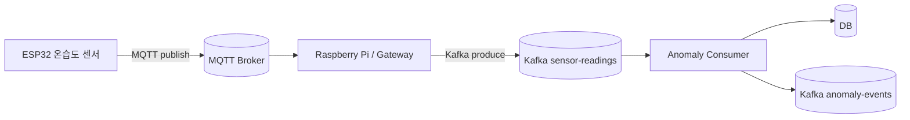
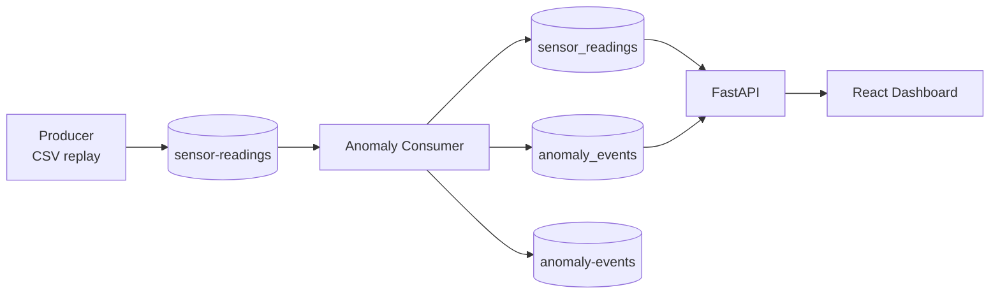
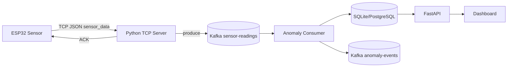
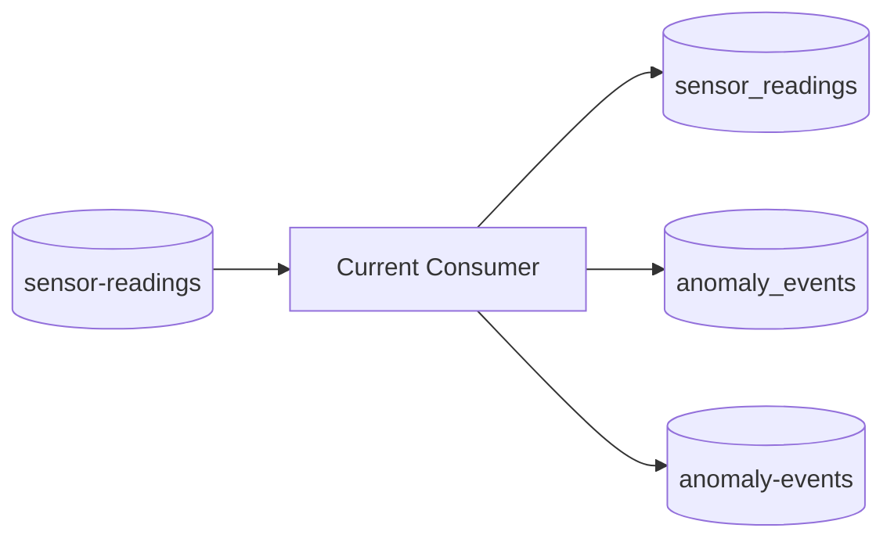
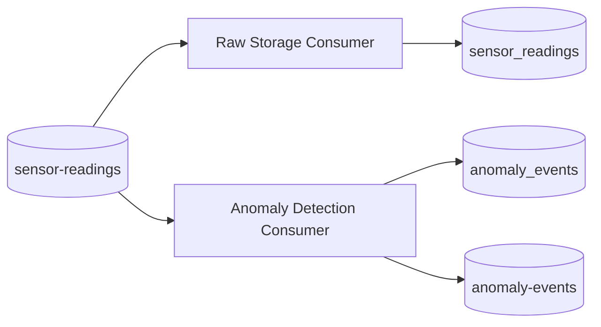
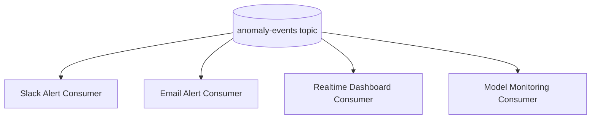

# Kafka Flow Notes

Kafka를 처음 보는 기준으로 이 프로젝트의 실행 흐름을 정리한 문서입니다.

## 왜 Kafka를 쓰는가

센서 데이터는 계속 발생하고, 이를 처리하는 기능은 여러 개로 나뉠 수 있습니다.

- 원천 데이터 저장
- 이상탐지
- 알림
- dashboard 갱신
- 추후 모델 재학습용 적재

Kafka를 쓰면 producer는 topic에 메시지만 보내고, consumer들은 각자 필요한 속도로 메시지를 읽을 수 있습니다.

## MQTT와 Kafka의 역할 차이

IoT 단말 통신에는 MQTT가 더 자연스럽습니다. Kafka와 MQTT는 둘 다 pub/sub처럼 보이지만 위치와 목적이 다릅니다.

| 구분 | MQTT | Kafka |
| --- | --- | --- |
| 주 사용 위치 | 디바이스와 서버/gateway 사이 | 서버 내부 데이터 파이프라인 |
| 목적 | 가벼운 실시간 메시징 | 대량 스트리밍, 저장, 재처리 |
| 클라이언트 | ESP32, 센서, 모바일, gateway | 서버, consumer app, stream processor |
| 메시지 처리 | broker가 subscriber에게 전달 | consumer가 topic을 poll해서 읽음 |
| 재처리 | 상대적으로 약함 | offset 기반 재처리 가능 |

현실적인 IoT 구조는 다음과 같이 잡을 수 있습니다.



현재 프로젝트는 MQTT gateway를 생략하고 CSV replay producer가 Kafka에 직접 publish합니다. 실제 치톤피드에 붙일 때는 기존 TCP 서버가 gateway 역할을 맡아도 됩니다.

## 현재 구현



## 실제 치톤피드 TCP 구조에 붙이는 방식

현재 치톤피드 TCP 구조에 붙인다면 TCP 서버가 Kafka producer 역할을 같이 하면 됩니다.



역할 분리:

```text
TCP server:
- 디바이스 연결 관리
- 메시지 파싱
- ACK 응답
- sensor_data를 Kafka topic에 produce

Kafka consumer:
- Kafka topic poll
- raw sensor data 저장
- rule-based 이상탐지
- Isolation Forest score 계산
- anomaly event 저장/publish
```

TCP 서버가 DB 저장과 이상탐지까지 모두 맡으면 디바이스 통신 로직이 무거워집니다. Kafka를 중간에 두면 통신 계층과 데이터 처리 계층을 분리할 수 있습니다.

## Producer

파일:

```text
producer/simulator.py
```

역할:

1. `data/processed/sensor_readings.csv`를 읽음
2. 각 row를 JSON으로 변환
3. `sensor-readings` topic에 publish

## Consumer

파일:

```text
consumer/main.py
```

역할:

1. `sensor-readings` topic에서 메시지 consume
2. `sensor_readings` 테이블에 raw data 저장
3. rule-based detector 실행
4. Isolation Forest detector 실행
5. anomaly가 있으면 `anomaly_events` 테이블에 저장
6. anomaly event를 `anomaly-events` topic에 publish

현재 MVP에서는 하나의 consumer가 raw 저장과 이상탐지를 모두 수행합니다.



운영 구조에서는 consumer를 분리할 수 있습니다.



이렇게 분리하면 저장 로직과 이상탐지 로직을 독립적으로 배포하고 확장할 수 있습니다.

## Topic

Topic은 메시지가 들어가는 통로입니다.

```text
sensor-readings
  producer -> consumer

anomaly-events
  consumer -> future alert/dashboard consumers
```

현재 dashboard는 DB를 API로 조회하지만, 나중에는 `anomaly-events` topic을 별도 alert consumer가 읽도록 확장할 수 있습니다.


